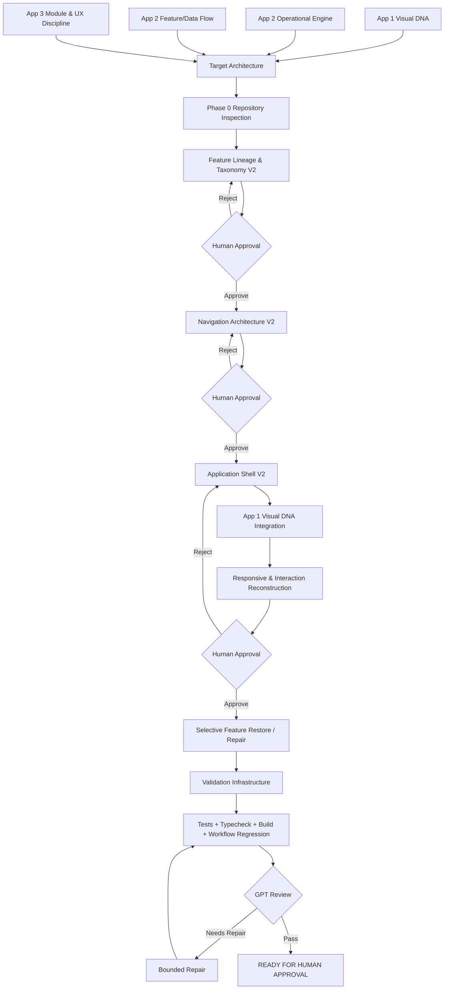

# IMPLEMENTATION_PLAN.md

## Project
APP 4 — APP 2 ENGINE + APP 1 UI DNA + APP 3 UX / MODULE DISCIPLINE

## Status
PLANNING ONLY — NO PRODUCTION CODE CHANGES APPROVED YET

---

## 1. OBJECTIVE

สร้างเวอร์ชันถัดไปของระบบโดยใช้ **App 2 เป็นฐานระบบหลัก** เพราะมี Workflow, Central State, Automation, Data Flow และ Safety Integration ที่แข็งแรงกว่าเดิม แล้วนำ:

- **App 1** มาเป็นต้นแบบด้าน Visual DNA, Responsive, Motion, Report/Export และแนวทาง Separation of Concerns
- **App 3 (SYSTEM_ARTY)** มาเป็นกรอบกำกับด้าน Module Taxonomy, Cross-Module Workflow, Concrete UI Interaction, Safety/Override และ Ergonomics

เป้าหมายไม่ใช่การเขียนระบบใหม่จากศูนย์ และไม่ใช่การนำ UI ของ App 1 มาครอบ App 2 แบบตรง ๆ

เป้าหมายคือ:

> Preserve App 2 operational engine → restructure information architecture → redesign navigation/layout → restore selected App 1 strengths → apply App 3 interaction discipline.

---

## 2. SOURCE OF TRUTH HIERARCHY

### Tier 1 — Current Runtime / Feature Truth
ใช้ App 2 เป็นฐานสำหรับพฤติกรรมระบบปัจจุบัน

- `WORKFLOW.md`
- `B-WORKFLOW.md`
- `04_FEATURE_INVENTORY.md`
- `05_FEATURE_TAXONOMY_CURRENT.md`
- `06_USER_WORKFLOWS.md`
- `09_NAVIGATION_MAP.md`
- `11_STATE_MANAGEMENT.md`
- `12_DATA_FLOW.md`
- `13_BUSINESS_RULES.md`
- `14_CALCULATION_ENGINE.md`
- `22_ERROR_VALIDATION_RULES.md`
- `26_PROJECT_STATUS_AS_IS.md`
- `27_KNOWN_ISSUES.md`
- `28_TECH_DEBT.md`
- `29_DEAD_UNUSED_DUPLICATED.md`
- `32_FEATURE_GAP_ANALYSIS.md`
- `33_EVIDENCE_INDEX.md`

### Tier 2 — App 1 Historical / Visual Intent
ใช้สำหรับ Visual DNA และฟีเจอร์เดิมที่ควรตรวจว่าต้องนำกลับหรือไม่

- `FIRST_ALL_PROJECT.md`
- `lithos-hero.md`

### Tier 3 — App 3 Design Discipline
ใช้เป็นกรอบออกแบบ ไม่ใช้เป็นหลักฐานว่า App 2 มีฟีเจอร์นั้นอยู่จริง

- `SYSTEM_ARTY.md`

---

## 3. OBSERVED

### App 1
- เป็น Feature/View-centric SPA
- มีแนวคิด premium UI, glassmorphism, gradients, backdrop blur, motion
- เน้น responsive/adaptive
- ใช้ component-driven architecture
- ตั้งใจแยก visual / business logic / shared state
- มีฟีเจอร์เช่น Report, M.17, Deflection, Crater, Tactical HUD, Map, Weapons

### App 2
- เป็น State-driven Operational System
- ใช้ shared operational state เป็นแกน
- Feature หลายตัวถูกยุบจาก “หน้า” ให้กลายเป็นส่วนหนึ่งของ workflow
- FO → activeTarget → Map/FDC
- M.17 → gunPositions → FDC/Map
- Bubble / ICM / Min QE → FIRE safety gate
- มี Fire Mission lifecycle, timer, splash, impact, sound, console/event log
- มี Window Manager / Tactical Map / 8 operational windows
- มี 40 features ตาม current inventory
- มี feature integration บางส่วนที่ยังไม่ครบ เช่น headingMils, fuzeTime, gridOffset, supplementaryCharge
- Desktop-first และ mobile/touch ยังอ่อน
- ไม่มี automated test suite

### App 3
- เป็น methodology / design discipline
- บังคับให้ทุก feature มี:
  - Module
  - Feature
  - Legacy
  - Next-Gen
  - UI Input
  - System Output
  - Module Interconnection
  - Screen Display
- เน้น concrete gestures
- เน้น safety lockout / override
- เน้น cross-module dependency
- เน้น ergonomics และ workflow order

---

## 4. UNKNOWN

ยังต้องให้ Codex/Agent ตรวจ repository จริงก่อนเริ่ม implementation เพื่อยืนยัน:

- Exact current file paths และ component boundaries
- ฟีเจอร์ App 1 ใดที่ยังมี source อยู่จริงใน repository ปัจจุบัน
- Report/PDF implementation ที่สามารถ reuse ได้หรือไม่
- Responsive implementation ของ App 1 ที่นำกลับมาใช้ได้แค่ไหน
- Motion components / Framer Motion ของ App 1 ที่ยังมี code อยู่หรือไม่
- Current App 2 repository state หลังการทดลอง/แก้ไขล่าสุด
- Exact dependencies / versions ใน repository ที่จะใช้จริง
- Current build status ณ เวลาเริ่ม implementation

ห้ามสมมุติสิ่งเหล่านี้ก่อน repository inspection

---

## 5. ASSUMPTIONS

1. App 2 จะเป็น runtime/system baseline
2. Calculation semantics และ business rules ของ App 2 จะไม่ถูก redesign ใน phase UI
3. App 1 จะถูกใช้เป็น visual/reference source ไม่ใช่ production source อัตโนมัติ
4. App 3 จะใช้เป็น design governance ไม่ใช่ runtime implementation
5. การย้าย feature ระหว่างหมวดต้องรักษา data flow เดิม
6. UI redesign ต้องไม่ลด automation ของ App 2

---

## 6. RISKS

### R1 — UI Redesign ทำลาย Workflow
หาก redesign จาก screenshot โดยไม่ดู state/data flow อาจทำให้ feature ที่เชื่อมกันกลายเป็น isolated tool

### R2 — Reintroduce App 1 Architecture Debt
ห้ามนำ `currentView` / modal-centric architecture กลับมาทั้งระบบเพียงเพราะ UI ดูดีกว่า

### R3 — Category Drift
Feature เช่น Crater อาจอยู่ผิด operational category แม้ component ทำงานได้

### R4 — Duplicate Navigation
App 2 มีหลาย access points เปิด window เดียวกัน ทำให้ UX สับสน

### R5 — Responsive Regression
App 2 มี mouse-only drag และ fixed-pixel windows

### R6 — Testless Refactor
ไม่มี automated tests ป้องกัน calculation/data-flow regression

### R7 — State Refactor Scope Explosion
หากย้าย state architecture พร้อม redesign ทั้งหมดในครั้งเดียว มีความเสี่ยงสูง

---

## 7. DECISION

### Primary Decision

ใช้ **App 2 เป็นฐานระบบ**

ไม่ rewrite engine

ไม่ย้อน architecture ไป App 1

ใช้ App 1 เพื่อ:
- Visual language
- responsive principles
- motion principles
- report/export candidate
- component separation patterns

ใช้ App 3 เพื่อ:
- module classification
- workflow-based navigation
- UI interaction specification
- safety/override rules
- cross-module connectivity
- ergonomic standards

---

## 8. FEATURE DISPOSITION MATRIX

| Domain / Feature | App 1 | App 2 | App 3 Guidance | Decision |
|---|---|---|---|---|
| System Shell | View/Modal SPA | Desktop + Windows | Workflow-first modules | REDESIGN SHELL |
| Visual Style | Premium / Glass / Motion | Tactical Win32 | Ergonomics-first | RESTORE APP1 DNA |
| Report / Export | Present | Missing | Structured Output | RESTORE / REBUILD |
| M.17 | Plotting view | Gun positioning operational tool | Concrete drag interaction | KEEP APP2 / REDESIGN UI |
| Deflection | Separate view | Merged in FDC pipeline | Cross-module integration | KEEP MERGED |
| Min QE | Calculator/report logic | Active FIRE gate | Safety lockout | KEEP APP2 |
| Crater | Separate view | Embedded in Howitzer | Correct module ownership | MOVE CATEGORY |
| Tactical HUD / Map | Separate view | Persistent operational surface | Shared situational awareness | KEEP APP2 |
| Forward Observer | Feature set | Expanded + auto sync | Target acquisition workflow | KEEP / EVOLVE |
| Adjustment | Separate view | Embedded in FO workflow | Concrete adjustment interaction | KEEP MERGED |
| Survey | Limited/fragmented | Unified module | Operational role alignment | KEEP / COMPLETE |
| FDC | Multiple tools | Integrated engine | Decision module | KEEP APP2 |
| Weapons / Fuze | Separate module | Partially integrated | Safety + recommendation | KEEP / COMPLETE |
| ICM Safety | Partial concept | FIRE gate | Safety module | KEEP APP2 |
| Misfire | Not clearly present | Timer + SOP | Emergency workflow | KEEP APP2 |
| Compass | HUD/compass concept | Level integrated, heading isolated | Cross-module dependency | REPAIR |
| Munitions | Limited | Cutaway + warnings | Decision/safety integration | COMPLETE |
| Fire Mission | Limited | Full lifecycle | Workflow state | KEEP APP2 |
| Console / Event Log | Not core | Present | Cross-module visibility | KEEP / RESTRUCTURE |
| Kill Switch | Not clear | Present | Explicit emergency semantics | KEEP / HARDEN |
| Persistence | More ambitious | Minimal | Operational continuity | IMPROVE |
| Navigation | Sidebar/currentView | 4 duplicated entry surfaces | Workflow hierarchy | REDESIGN |
| Responsive | Planned | Weak | Ergonomics | RESTORE/REBUILD |
| Motion | Strong design intent | Reduced | Feedback-driven | RESTORE SELECTIVELY |
| Testing | Planned | None | Validation discipline | ADD |
| State Architecture | Context-oriented | Giant App + prop drilling | Flow first | DEFER STRUCTURAL REFACTOR |

---

## 9. TARGET INFORMATION ARCHITECTURE

Do not finalize names until repository inspection.

Provisional target:

### A. Command / Overview
- Operational status
- active target
- current firing state
- safety status
- key alerts

### B. Target Acquisition / Observer
- Grid
- Polar
- Shift
- Adjustment
- Flash-to-Bang
- Mil Formula

### C. Survey / Positioning
- Traverse
- Intersection
- Slope
- Grid Calibration
- candidate Crater / Counter-Battery tools subject to final role analysis

### D. Fire Direction
- Ballistics
- corrected range
- deflection
- Min QE
- per-gun corrections
- fire mission execution

### E. Gun / Howitzer
- M.17 gun positioning
- gun offsets
- section-level status

### F. Weapons / Ammunition
- ammunition
- fuze
- ICM safety
- misfire
- munitions information

### G. Navigation / Tactical Map
- persistent situational view
- targets
- guns
- friendly position
- projectile state
- safety overlays

### H. System / Console
- logs
- OPSEC
- system status
- emergency controls
- persistence/session controls

---

## 10. TARGET UI PRINCIPLES

### From App 1
- Premium visual hierarchy
- Glass / translucent surfaces
- controlled gradients
- backdrop blur
- subtle motion
- responsive design
- cleaner typography hierarchy

### From App 2
- Persistent operational context
- live data
- shared state
- automatic recalculation
- safety status
- map as shared surface

### From App 3
- exact gestures
- explicit status
- module interconnection
- safety trigger / lockout / override
- confidence/recommendation where appropriate
- role-first information order

---

## 11. PHASED IMPLEMENTATION PLAN

### PHASE 0 — Repository Inspection & Architecture Freeze

Goal:
ยืนยันสถานะ source code จริงก่อนแก้

Tasks:
- Read project policies
- Read App 1 / App 2 / App 3 reference docs
- Inspect repository tree
- Identify actual App 2 entry points
- Verify 40-feature inventory
- Verify current build
- Identify source files responsible for Shell / Navigation / Windows / Map / each operational module
- Produce FILE_CHANGE_PLAN
- No production modification

Exit Gate:
`ARCHITECTURE_BASELINE_VERIFIED`

---

### PHASE 1 — Feature Lineage & Taxonomy Lock

Goal:
จัดหมวด feature โดยไม่เปลี่ยน logic

Tasks:
- Map App 1 → App 2 lineage
- Classify:
  - EVOLVED
  - MERGED
  - NEW
  - LOST
  - PARTIAL
  - DUPLICATED
- Establish target module ownership
- Resolve Crater placement
- Resolve redundant navigation ownership
- Identify Global / Shared / Safety features

Deliverable:
`FEATURE_TAXONOMY_V2.md`

Exit Gate:
Human approval required

---

### PHASE 2 — Navigation Architecture V2

Goal:
ลด navigation ซ้ำซ้อนโดยไม่เสีย accessibility to features

Tasks:
- Define one primary navigation model
- Define secondary/contextual access
- Define map/shared workspace behavior
- Remove conceptual duplication between:
  - Header Quick Launch
  - Desktop Icons
  - Taskbar
  - Start Menu
- Preserve emergency access separately

Deliverable:
`NAVIGATION_ARCHITECTURE_V2.md`

Exit Gate:
Human approval required

---

### PHASE 3 — Application Shell V2

Goal:
เปลี่ยน shell โดยไม่เปลี่ยน engine

Tasks:
- Build target desktop/tablet/mobile layout concept
- Preserve Tactical Map context where appropriate
- Replace uncontrolled Win32 layout with governed workspace
- Define:
  - primary workspace
  - tool panel
  - status panel
  - contextual drawer/modal
  - mobile fallback
- Preserve all underlying callbacks/state flow

Validation:
- No feature loss
- No data-flow regression

---

### PHASE 4 — App 1 Visual DNA Integration

Goal:
นำความสวยของ App 1 กลับมาโดยไม่ย้อน architecture

Tasks:
- Extract visual tokens
- Define semantic color system
- Define typography hierarchy
- Define surfaces/cards
- Define glass treatment
- Define motion rules
- Define alert/safety variants
- Define reusable Button/Input/Panel/Tab primitives

Do NOT:
- copy old UI blindly
- reintroduce old page architecture
- add motion that hides operational state

Deliverable:
`DESIGN_SYSTEM_V2.md`

---

### PHASE 5 — Responsive & Interaction Reconstruction

Goal:
แก้ desktop-only limitations

Tasks:
- Replace mouse-only interaction with pointer-compatible interaction where required
- Define mobile fallback for windowed tools
- Avoid fixed 420px+ windows on narrow screens
- Define touch targets
- Define keyboard interactions
- Define overflow behavior
- Preserve map interactions

Validation:
- Desktop
- Tablet
- Mobile
- Keyboard
- Pointer/touch

---

### PHASE 6 — Restore High-Value App 1 Capabilities

Candidate:
- Report / Export
- relevant motion
- reusable component structure
- persistence behavior

Each candidate requires repository evidence and separate approval.

Do not automatically restore old features.

---

### PHASE 7 — Complete App 2 Partial Integrations

Candidate tasks:
- headingMils → proper downstream consumer
- fuzeTime → actual consumer if domain requirement supports it
- gridOffset → coordinate transform consumer
- supplementaryCharge → correct safety integration
- Crater CB coordinates → remove hardcoded result
- OPSEC scope completion
- system volume → real sound control

These are NOT part of initial UI redesign unless explicitly approved.

---

### PHASE 8 — Validation Infrastructure

Minimum:
- Typecheck
- Build
- Unit tests for calculation engine
- Regression tests for safety gates
- Workflow tests for:
  - FO → Target → FDC
  - M17 → gun positions → FDC
  - ICM → FIRE gate
  - Bubble → FIRE gate
  - Min QE → FIRE gate
  - Fire Mission lifecycle

---

## 12. SCOPE LOCK

### IN SCOPE — Initial UI/IA Modernization
- Feature taxonomy
- navigation architecture
- app shell
- layout
- responsive behavior
- design system
- motion system
- reusable UI primitives
- preserve App 2 engine/data flow

### OUT OF SCOPE — Until separately approved
- ballistic formula redesign
- weapon-domain rule changes
- server/backend
- authentication productionization
- WebSocket implementation
- database redesign
- replacing central state architecture
- multi-user
- deployment redesign
- adding AI decision making

---

## 13. ACCEPTANCE CRITERIA

1. All current App 2 operational features remain accessible.
2. App 2 data flow remains unchanged unless explicitly approved.
3. FO target creation still propagates to Map/FDC.
4. M.17 gun changes still propagate to FDC/Map.
5. Existing FIRE safety gates still function.
6. Fire Mission lifecycle still functions.
7. Crater ownership is clearly classified.
8. Navigation duplicate surfaces are reduced or formally justified.
9. Layout supports desktop and a defined mobile/tablet fallback.
10. All important buttons have functional event/state behavior.
11. App 1 visual DNA is recognizable without restoring old architecture.
12. App 3 interaction/safety rules are reflected in specifications.
13. Typecheck passes.
14. Production build passes.
15. Approved regression tests pass.
16. No unauthorized source/module changes.

---

## 14. DEFINITION OF DONE

The redesign phase is DONE only when:

- Feature Taxonomy V2 approved
- Navigation Architecture V2 approved
- Application Shell V2 implemented
- Design System V2 implemented
- Responsive behavior verified
- All approved App 2 features reachable
- Existing automation/data flow preserved
- Safety gates regression-tested
- No critical UX duplication remains
- Build passes
- Typecheck passes
- Required tests pass
- Execution report supplied
- Human final approval received

---

# TASK CONTRACT

## TASK_ID
APP2-UI-ARCHITECTURE-V2-001

## OBJECTIVE
Modernize App 2 information architecture, navigation, application shell, responsive UX and visual system while preserving its operational engine, automation, state/data flow and safety behavior.

## PROBLEM_STATEMENT
App 2 has stronger operational workflow and automation than App 1, but its UI shell, navigation duplication, feature categorization, responsive behavior and visual presentation are weaker. The next version must retain App 2 system behavior while using App 1 visual strengths and App 3 interaction/module discipline.

## IN_SCOPE
- repository inspection
- feature lineage mapping
- target taxonomy
- navigation V2
- application shell V2
- layout redesign
- responsive UX
- design tokens/components
- motion guidance
- regression validation

## OUT_OF_SCOPE
- ballistic formula changes
- business rule changes
- backend
- auth server
- WebSocket
- database architecture
- unapproved feature additions
- broad state-management rewrite

## ALLOWED_PATHS
UNKNOWN until repository inspection.

Codex must inspect the repository and propose exact allowed paths before implementation.

## FORBIDDEN_PATHS
Until approved:
- calculation/business-rule files
- deployment infrastructure
- server/backend files
- unrelated projects/folders
- generated build output
- dependency manifests unless explicitly approved

## ACCEPTANCE_CRITERIA
See Section 13.

## VALIDATION_REQUIREMENTS
- repository evidence review
- typecheck
- build
- targeted unit/regression tests
- manual workflow verification
- responsive verification
- files changed report
- scope compliance report

## RISK_LEVEL
HIGH

Reason:
UI shell and navigation touch many feature entry points and can cause workflow regressions even without changing business logic.

## MAX_REPAIR_CYCLES
2

## HUMAN_APPROVAL_REQUIRED
YES

Human approval required after:
1. Feature Taxonomy V2
2. Navigation Architecture V2
3. Layout / Application Shell design
4. Before production implementation
5. Final acceptance

---

# CODEX EXECUTION ORDER

Copy this section into Codex only after human approval.

```text
TASK_ID: APP2-UI-ARCHITECTURE-V2-001

1. Read all project policies and repository-level instructions.

2. Read the approved Task Contract completely.

3. Read the architecture and evidence documents relevant to:
   - App 1 historical design intent
   - App 2 current feature/runtime behavior
   - App 3 module/interaction discipline

4. Inspect the current repository state.

5. Verify:
   - actual framework and versions
   - source tree
   - App entry point
   - navigation implementation
   - window/shell implementation
   - Tactical Map
   - operational module components
   - shared state/data-flow entry points
   - calculation and safety files that must remain read-only

6. Produce a concise repository evidence report.

7. Propose exact ALLOWED_PATHS and FORBIDDEN_PATHS.

8. STOP before implementation if the actual repository contradicts the approved architecture plan.

9. Create a concise execution plan limited to the approved scope.

10. Implement only approved UI/IA changes.

11. Preserve:
    - operational state behavior
    - calculation behavior
    - safety gates
    - fire mission lifecycle
    - cross-module data propagation

12. Do not redesign requirements or introduce new frameworks/libraries unless repository evidence proves the approved plan cannot be implemented safely.

13. Run required validation:
    - typecheck
    - build
    - approved tests
    - workflow regression checks
    - responsive checks

14. Produce EXECUTION_REPORT.md containing:
    - files changed
    - files added
    - commands executed
    - test results
    - typecheck result
    - build result
    - acceptance criteria evidence
    - unresolved issues
    - scope deviations
    - security impact
    - regression risks

15. Stop and report BLOCKED if the task cannot be completed without violating approved scope.
```

---

## 15. IMPLEMENTATION DECISION FLOW


