# 03_ARCHITECTURE_AS_IS

## ENTRY POINT

**VERIFIED:**
- HTML entry: `index.html` (loads bundled `<script type="module" src="/src/main.tsx">`)
- JS entry: `src/main.tsx:1-10`
  - Wraps `<App/>` ใน `<StrictMode>` และ mount ที่ `document.getElementById('root')`
- Root component: `src/App.tsx` (default export)

## APP SHELL

**VERIFIED (`src/App.tsx:378-800`):**

```
<div className="relative w-screen h-screen overflow-hidden bg-[#040404]">
  <TacticalMap ... />              ← z-0: full-screen Canvas
  {showRestoredBanner && <Banner/>} ← z-50: transient banner
  <header className="h-12">...</header>    ← z-40: top header
  <main className="pt-12 pb-12">
    <Desktop icons>
    <Window observer/>
    <Window surveillance/>
    <Window howitzer/>
    <Window fdc/>
    <Window weapons/>
    <Window compass/>
    <Window munitions/>
    <Window console/>
  </main>
  {isStartMenuOpen && <StartMenu/>}         ← z-50
  <footer className="h-12">Taskbar</footer>  ← z-40
</div>
```

**Layer order (Verified via z-index and DOM order):**

| Layer | z-index | Content |
|---|---|---|
| Background | (base) | TacticalMap Canvas |
| Desktop icons | z-10 | Emoji shortcuts |
| Floating windows | dynamic (1..N via `handleFocusWindow`) | 8 modules |
| Compass widget (in map) | z-40 | rotating compass |
| Map controls (zoom) | z-40 | ZoomIn/ZoomOut |
| Map legend | z-40 | Legend box |
| Header bar | z-40 | Title + quick buttons + OPSEC |
| Footer taskbar | z-40 | Start + tasks + tray |
| Start Menu | z-50 | Overlay when open |
| Restored banner | z-50 | 4-sec transient |
| Login modal | z-50 | Pre-login gate |
| Lockout screen | z-50 | Post-kill-switch |

## UI / VIEW ARCHITECTURE

**VERIFIED:** No routing library. View state = 3 mutually-exclusive top-level branches in `App.tsx`:

```
App.tsx render:
├─ if (forceLockout) → Lockout screen (App.tsx:347-371)
├─ else if (!isLoggedIn) → <LoginModal onSuccess={handleLoginSuccess}/> (App.tsx:373-376)
└─ else → Dashboard layout (App.tsx:378-800)
```

**Within Dashboard:** 8 windows conditionally rendered by `windows[i].isOpen` (App.tsx:494-660).

## CONTEXT / STATE ARCHITECTURE

**VERIFIED — Absent:**
- ❌ No `createContext(...)` calls anywhere
- ❌ No `<...Provider>` components
- ❌ No Zustand, Redux, Jotai, Recoil, MobX imports in `package.json`
- ❌ No custom hooks

**VERIFIED — Actual pattern:**
- **Single-file state store:** ~20 `useState` hooks in `App.tsx:19-113`
- **Prop drilling:** state passed down as props; mutations passed as `onXxx` callbacks
- **2 useEffect timers** at App level (Fire mission 10Hz, Misfire 1Hz, Clock 1Hz — 3 total)
- **Component-local state:** each window has its own `useState` for form inputs (verified in each `*Window.tsx`)

**State ownership summary:**

| State | Owner | Read by |
|---|---|---|
| Global session (isLoggedIn, operatorId, batteryCoords) | App.tsx | LoginModal, TacticalMap |
| Domain (targetsList, activeTarget, gunPositions) | App.tsx | ForwardObserver, Howitzer, Fdc, TacticalMap |
| Calibration (headingMils, bubbleOffset, gridOffset) | App.tsx | Compass, FDC (levelIsCentered derived only) |
| Munitions (ammuType, fuzeType, fuzeTime, supplementaryCharge) | App.tsx | Weapons, Munitions, FDC (icmSafe derived only) |
| Fire mission (fireMissionActive, ToF, progress, timeLeft) | App.tsx | FDC, TacticalMap |
| Emergency (misfireActive, misfireTimeLeft) | App.tsx | Weapons |
| UI shell (windows, isStartMenuOpen, audioVolume, systemTime) | App.tsx | Header, Taskbar, Start Menu |
| Form inputs | each Window component | that window only |

## BUSINESS LOGIC BOUNDARIES

**VERIFIED — 2 pure-function modules:**

1. **`src/utils/ballistics.ts`** — 6 exports:
   - `CHARGE_5_FIRE_TABLE` (constant)
   - `interpolateBallistics(range)` — linear interp
   - `calculateWindSplitting(azimuth, speed, direction)` — vector split
   - `calculatePolarPlot(foE, foN, azimuth, distance)` — coord transform
   - `milsToDegrees(mils)` / `degreesToMils(deg)` — unit conversion
   - `GUN_VE_VARIANCES`, `INITIAL_GUN_POSITIONS`, `GunPosition` type

2. **`src/components/SoundGenerator.ts`** — 5 exports:
   - `playClick`, `playBeep`, `playAlarm`, `playFireSound`, `playSplashSound`

**INFERRED — In-component logic (NOT extracted to pure fns):**
- Traverse closure calc: inline in `SurveillanceWindow.tsx`
- Intersection solver: inline in `SurveillanceWindow.tsx`
- Slope-to-horizontal: inline in `SurveillanceWindow.tsx`
- Crater weapon identification: inline in `HowitzerWindow.tsx`
- Min QE calculation + Math.ceil: inline in `FdcWindow.tsx`
- Distance to friendly: inline in `App.tsx:333-338`
- Level bubble threshold: inline in `App.tsx:342`

## PERSISTENCE BOUNDARIES

**VERIFIED:**
- **`localStorage.getItem('artyc2_battery_coords')`** — read in `LoginModal.tsx`
- **`localStorage.setItem('artyc2_battery_coords', JSON.stringify(coords))`** — write in `LoginModal.tsx` (Setup submit)
- **`localStorage.clear()`** — Kill Switch (`App.tsx:302`)
- **`indexedDB.deleteDatabase('fdc_offline_queue')`** — Kill Switch (`App.tsx:306`)

**VERIFIED absent:**
- No `sessionStorage` usage
- No `IndexedDB.open()` — the deletion call targets a DB that is never created
- No `localforage`, `dexie`, `pouchdb`, or SQL wasm libs

## INTEGRATION BOUNDARIES

**VERIFIED — No external integrations:**
- No `fetch()`, `XMLHttpRequest`, `axios`, `ky`, or `got` in code
- No `WebSocket`, `EventSource`, `socket.io` imports
- No Google Maps / Leaflet / Mapbox libraries (Canvas map is hand-drawn)
- No third-party auth (OAuth, Firebase, Supabase, Clerk)
- No analytics (GA, Segment, PostHog)
- No error tracking (Sentry, Rollbar)
- No CDN calls at runtime (Google Fonts CSS is loaded via `<link>` in `index.html` — this is the only network call)

**VERIFIED browser APIs used:**
- `AudioContext` / `webkitAudioContext` (SoundGenerator.ts)
- `HTMLCanvasElement.getContext('2d')` (TacticalMap.tsx)
- `localStorage`, `indexedDB.deleteDatabase` (App.tsx, LoginModal.tsx)
- `setInterval`, `setTimeout`, `clearInterval` (App.tsx, LoginModal.tsx, ForwardObserverWindow.tsx)
- `window.innerWidth/innerHeight` (WindowManager.tsx maximize, TacticalMap.tsx resize)
- `window.addEventListener('resize'|'mousemove'|'mouseup')` (WindowManager, TacticalMap, Compass, Howitzer)
- `window.confirm()` (ControlPanelWindow Kill Switch)
- `Date` / `Math.random`, `Math.sin`, `Math.cos`, `Math.atan2`, `Math.sqrt`, `Math.ceil`, `Math.round`, `Math.floor`

## OVERLAY / MODAL / WINDOW ARCHITECTURE

**VERIFIED — 4 patterns of "overlay":**

1. **Modal (mutually exclusive with dashboard):**
   - `LoginModal` (fixed inset-0, z-50)
   - Lockout screen (fixed inset-0, z-50)

2. **Toast (transient):**
   - Restored banner (absolute top-14, z-50, auto-hide 4s via `setTimeout`)

3. **Popup (overlay while dashboard visible):**
   - Start Menu (absolute bottom-12, z-50, click to toggle)

4. **Floating Window (dashboard-embedded):**
   - 8 `<Window>` components from `WindowManager.tsx`
   - Each: draggable via title bar, resizable via se-corner grip, minimizable, closable, maximizable (fills screen minus header/footer)
   - z-index dynamic (max+1 on click)

## SHARED TOOLS (cross-module)

| Tool | File | Consumers |
|---|---|---|
| `playClick` | SoundGenerator.ts | ALL 10 UI files |
| `playBeep` | SoundGenerator.ts | Login, Forward, Fdc, Compass, Weapons, Munitions, Howitzer, App |
| `playAlarm` | SoundGenerator.ts | App (misfire tick), Weapons (misfire trigger) |
| `playFireSound` | SoundGenerator.ts | Fdc (fire execute) |
| `playSplashSound` | SoundGenerator.ts | App (timer completion) |
| `interpolateBallistics` | ballistics.ts | Fdc (2 calls: raw + corrected) |
| `calculateWindSplitting` | ballistics.ts | Fdc |
| `calculatePolarPlot` | ballistics.ts | ForwardObserver, App (simulate call uses inline sin/cos instead) |
| `milsToDegrees` | ballistics.ts | TacticalMap (compass rotation) |
| `GUN_VE_VARIANCES` | ballistics.ts | Fdc (per-gun QE calc) |
| `INITIAL_GUN_POSITIONS`, `GunPosition` type | ballistics.ts | App.tsx |
| `Window`, `WindowData` | WindowManager.tsx | App.tsx (imported once, used 8 times) |

## CROSS-MODULE DEPENDENCIES (INFERRED via prop wiring)

```
ForwardObserverWindow  →  writes activeTarget, targetsList  →  read by TacticalMap, FDC
HowitzerWindow         →  writes gunPositions               →  read by TacticalMap, FDC
                          writes targetsList (Counter-Battery target)
CompassWindow          →  writes headingMils, bubbleOffset  →  ONLY bubbleOffset used (via levelIsCentered) by FDC
                                                                headingMils used by TacticalMap for compass widget only
SurveillanceWindow     →  writes gridOffset                 →  displayed in footer ONLY (not used in any calc)
WeaponsWindow          →  writes ammuType, fuzeType, misfireActive
                          reads friendlyDistance (derived in App)
                          → ammuType used by icmSafe (App), TacticalMap (shell label)
                          → fuzeType used by MunitionsWindow (VT safety warning)
                          → fuzeTime, supplementaryCharge NOT used in any calculation
MunitionsWindow        →  writes supplementaryCharge        →  read only by MunitionsWindow itself
FdcWindow              →  triggers onFireExecute → sets fireMission* in App
ControlPanelWindow     →  triggers Kill Switch → mutates ALL app state
                          triggers simulate call → mutates activeTarget, targetsList, logs
```

## MERMAID DIAGRAM: HIGH-LEVEL ARCHITECTURE

```mermaid
graph TB
    subgraph "index.html + main.tsx"
        E[Entry Point]
    end

    subgraph "App.tsx (God Component 802 lines)"
        AS[Central State Store<br/>~20 useState hooks]
        T1[Timer: FireMission 10Hz]
        T2[Timer: Misfire 1Hz]
        T3[Timer: Clock 1Hz]
        H[handleXxx callbacks<br/>focus/close/min/toggle/kill]
    end

    subgraph "UI Layer"
        LM[LoginModal<br/>Reads/Writes localStorage]
        TM[TacticalMap Canvas<br/>Full screen background]
        WM[WindowManager<br/>Wraps 8 features]
        HDR[Header + OPSEC toggle]
        TB[Taskbar + Start Menu]
        DI[Desktop Icons]
    end

    subgraph "Feature Windows"
        FO[ForwardObserverWindow]
        SW[SurveillanceWindow]
        HW[HowitzerWindow]
        FDC[FdcWindow]
        WW[WeaponsWindow]
        CW[CompassWindow]
        MW[MunitionsWindow]
        CPW[ControlPanelWindow]
    end

    subgraph "Shared Logic"
        BAL[ballistics.ts<br/>Pure functions]
        SND[SoundGenerator.ts<br/>Web Audio API]
    end

    subgraph "Persistence"
        LS[(LocalStorage<br/>artyc2_battery_coords)]
        IDB[(IndexedDB<br/>fdc_offline_queue<br/>delete-only)]
    end

    E --> AS
    AS <--> LM
    AS --> TM
    AS --> WM
    AS --> HDR
    AS --> TB
    AS --> DI
    WM --> FO
    WM --> SW
    WM --> HW
    WM --> FDC
    WM --> WW
    WM --> CW
    WM --> MW
    WM --> CPW
    FO -.props/callbacks.-> AS
    SW -.props/callbacks.-> AS
    HW -.props/callbacks.-> AS
    FDC -.props/callbacks.-> AS
    WW -.props/callbacks.-> AS
    CW -.props/callbacks.-> AS
    MW -.props/callbacks.-> AS
    CPW -.props/callbacks.-> AS
    FO -.uses.-> BAL
    FDC -.uses.-> BAL
    TM -.uses.-> BAL
    FO -.uses.-> SND
    FDC -.uses.-> SND
    WW -.uses.-> SND
    CW -.uses.-> SND
    HW -.uses.-> SND
    MW -.uses.-> SND
    LM -.uses.-> SND
    CPW -.uses.-> SND
    LM -.read/write.-> LS
    AS -.clear.-> LS
    AS -.deleteDatabase.-> IDB
    T1 --> AS
    T2 --> AS
    T3 --> AS
    AS --> H
```



## ARCHITECTURE STYLE (CLASSIFICATION)

**VERIFIED classification:**
- **Pattern:** Container/Presenter (`App.tsx` = container; window components = presenters)
- **State:** Lifted-up state / prop drilling (no context, no store)
- **Rendering:** Client-side only
- **Bundling:** All-in-one single HTML file (via `vite-plugin-singlefile`)
- **Reactivity:** Standard React reconciliation on `useState` updates + `useEffect` timers
- **Side effects:** Timers (setInterval), localStorage, indexedDB, Web Audio, Canvas drawing
