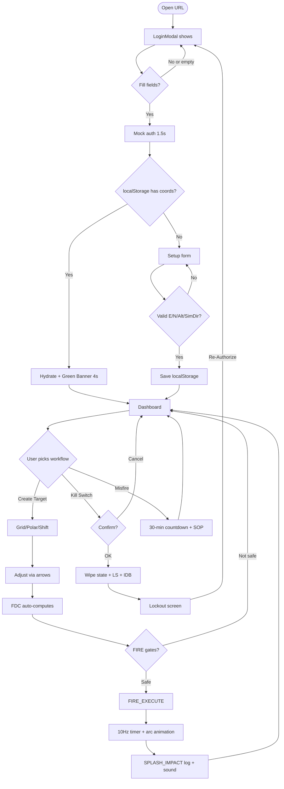

# 06_USER_WORKFLOWS

## WORKFLOW INVENTORY

| WF_ID | Name | Actor | Complexity |
|---|---|---|---|
| WF-01 | Boot & Session Init | Any operator | Low |
| WF-02 | Battery First-Time Setup | Any operator | Low |
| WF-03 | Create Target (Grid) | ผตน. | Low |
| WF-04 | Create Target (Polar) | ผตน. | Medium |
| WF-05 | Create Target (Shift from Known) | ผตน. | Medium |
| WF-06 | Adjust Existing Target | ผตน. | Low |
| WF-07 | Estimate Range via Flash-to-Bang | ผตน. | Low |
| WF-08 | Estimate Range via Mil Formula | ผตน. | Low |
| WF-09 | Traverse Survey (ทบ.344-202) | Surveyor | Medium |
| WF-10 | Solve Intersection | Surveyor | Low |
| WF-11 | Compute Slope-to-Horizontal | Surveyor | Low |
| WF-12 | Reposition Guns via M.17 Board | Gun Section | Medium |
| WF-13 | Crater Analysis → CB Target | Gun Section (anomaly) | High |
| WF-14 | Configure Level & Compass | Any | Low |
| WF-15 | Configure Fuze / Ammo | FDC | Low |
| WF-16 | Fire Mission (End-to-End) | FDC | High |
| WF-17 | Misfire Emergency Response | Any | Low |
| WF-18 | Kill Switch / Session Wipe | Commander | Low |
| WF-19 | Simulate Incoming Call | Any (demo) | Low |

---

## WF-01: BOOT & SESSION INIT

- **ACTOR:** Any operator
- **START:** URL open → `main.tsx` mounts `<App/>`
- **STEPS:**
  1. React StrictMode renders `<App/>` (double-render dev only)
  2. `App` initializes state: `isLoggedIn = false`, `forceLockout = false`
  3. Render branch: since `!isLoggedIn`, render `<LoginModal/>`
  4. User types operatorId + accessKey
  5. `handleLogin`: validate non-empty → `setIsAuthenticating(true)` → `setTimeout(1500ms)` (mock cryptohandshake)
  6. After delay: `playBeep(880)` → read `localStorage.getItem('artyc2_battery_coords')`
  7. IF found → `onSuccess({ restored: true })` → **WF-01 continues to Hydration branch**
  8. IF not found → `setShowSetup(true)` → **branches to WF-02**
- **STATE_TRANSITIONS:** `isAuthenticating: false→true→false`; `isLoggedIn: false→true` (only after Setup or Hydration)
- **COMPONENTS:** `LoginModal.tsx`
- **CALCULATIONS:** None
- **PERSISTENCE:** localStorage READ
- **OUTPUT:** Enter Dashboard (WF-16 possible) OR Setup form
- **END_STATE:** `isLoggedIn = true`, dashboard visible, either green banner (hydrated) or fresh (setup)
- **FAILURE_PATH:** Empty inputs → red error "วิกฤต: ต้องกรอกรหัสผู้ปฏิบัติการและรหัสลับ..." + beep 440Hz sawtooth
- **EVIDENCE:** `main.tsx:6-9`, `App.tsx:17-23,373-376`, `LoginModal.tsx:29-58`

## WF-02: BATTERY FIRST-TIME SETUP

- **START:** WF-01 step 8 (no cached coords)
- **STEPS:**
  1. Setup form appears with default values 32000/45000/120/1600
  2. User edits any of 4 fields
  3. User clicks "เข้าสู่ศูนย์บัญชาการ"
  4. `handleSetupSubmit`: validate `E>0 && N>0 && Alt≥0 && SimDir∈[0,6400]`
  5. `localStorage.setItem('artyc2_battery_coords', JSON.stringify(coords))`
  6. `playBeep(1000)` + `onSuccess({ restored: false })`
  7. App state set → dashboard visible + log `[ตั้งค่า]`
- **PERSISTENCE:** localStorage WRITE
- **FAILURE_PATH:** validation fail → red error "วิกฤต: ค่าปรับเทียบผิดพลาด..." + stays on Setup form
- **EVIDENCE:** `LoginModal.tsx:60-82,195-244`, `App.tsx:184-204`

## WF-03: CREATE TARGET (Grid)

- **ACTOR:** ผตน.
- **START:** User has ForwardObserverWindow open → clicks tab "วิธีพิกัดกริด"
- **STEPS:**
  1. Fill targetName, gridE, gridN, gridH
  2. Click "บันทึกพิกัดเป้าหมาย"
  3. `handleApplyGridTarget`: `playBeep(900)` → generate `id = 'T-' + rand(100..999)` → `onAddTarget` + `onSetTarget`
- **STATE_TRANSITIONS:** App: `targetsList` grows by 1; `activeTarget` = new target
- **CALCULATIONS:** None (direct input)
- **OUTPUT:** target rendered on map (crosshair, ring, threat dome); FDC recomputes range/azimuth/QE/ToF; log `[CALL_FOR_FIRE]`
- **END_STATE:** activeTarget = new
- **EVIDENCE:** `ForwardObserverWindow.tsx:96-107`

## WF-04: CREATE TARGET (Polar)

- **START:** ForwardObserverWindow → tab "วิธีเชิงขั้ว"
- **STEPS:**
  1. Fill foE, foN, polarAzimuth, polarDistance (can be pre-filled by WF-07 or WF-08)
  2. Click "คำนวณพิกัดเชิงขั้ว"
  3. `calculatePolarPlot(foE, foN, polarAzimuth, polarDistance)`:
     - `angleRad = azimuth × 2π / 6400`
     - `easting = foE + distance × sin(angleRad)`
     - `northing = foN + distance × cos(angleRad)`
  4. Add target with `name = 'POLAR-' + targetName`
- **UTILITIES:** `calculatePolarPlot` (ballistics.ts:100-116)
- **OUTPUT:** target on map + log
- **EVIDENCE:** `ForwardObserverWindow.tsx:109-124`

## WF-05: CREATE TARGET (Shift from Known Point)

- **START:** ForwardObserverWindow → tab "เลื่อนจากจุดรู้ค่า"
- **PRECONDITION:** At least 1 target in `targetsList`
- **STEPS:**
  1. Select known target from dropdown → `shiftFromId`
  2. Enter lateralShift, rangeShift, altitudeShift (m)
  3. Click "เลื่อนจากพิกัดที่รู้ค่า" (disabled if `!shiftFromId`)
  4. Find `knownPt`, compute `newE = known.E + lateral`, `newN = known.N + range`, `newH = known.H + alt`
  5. Add target `SHIFT-<knownName>`
- **⚠️ DOCTRINAL NOTE:** shift is purely UTM-axis translation, not line-of-sight rotated — see F008
- **EVIDENCE:** `ForwardObserverWindow.tsx:126-140`

## WF-06: ADJUST EXISTING TARGET

- **START:** activeTarget exists → click any arrow/text button in adjustment pad
- **STEPS:**
  1. `handleAdjustment(direction, value)` — guard: if `!activeTarget` → beep 440Hz + return
  2. Switch on direction: ADD→N+=v, DROP→N-=v, LEFT→E-=v, RIGHT→E+=v, UP→H+=v, DOWN→H-=v
  3. `onSetTarget(updated)` — mutates `activeTarget` (and same-id entry in list)
- **VISIBLE EFFECT:** target dot moves on map; FDC recomputes
- **EVIDENCE:** `ForwardObserverWindow.tsx:142-183`

## WF-07: FLASH-TO-BANG

- **STEPS:**
  1. Click "เริ่มจับเวลา" — `setTimerRunning(true)`, start `setInterval(100ms)` incrementing `timerSeconds`
  2. Wait...
  3. Click "หยุด (คำนวณ)" — `setTimerRunning(false)`, `dist = timerSeconds × 340`
  4. **Side effect:** `setPolarDistance(dist)` (fills WF-04 field)
- **EVIDENCE:** `ForwardObserverWindow.tsx:59-92`

## WF-08: MIL FORMULA

- **STEPS:**
  1. Slide objectWidth (5-100m)
  2. Type milAngle (mils)
  3. Live display: `computedMilDistance = (W × 1000) / M`
  4. Click "นำไปใช้ Nm" (disabled if `M=0`) → `setPolarDistance(computedMilDistance)`
- **EVIDENCE:** `ForwardObserverWindow.tsx:47-51`

## WF-09: TRAVERSE SURVEY (ทบ.344-202)

- **STEPS:**
  1. SurveillanceWindow → tab "ทบ.344-202"
  2. Table with 4 rows shown (S1→S2, S2→S3, S3→S4, S4→S1)
  3. Edit any cell (bearing or distance)
  4. Live compute: `closureDistError = √((Σ D·sin B)² + (Σ D·cos B)²)`
  5. IF `closureDistError > 10` OR `closureBearingError > 2` → yellow pulse card + **submit disabled**
  6. ELSE → green card + submit enabled
  7. Click submit → log `[วงรอบ]`
- **EVIDENCE:** `SurveillanceWindow.tsx:14-59,130-190`

## WF-10: INTERSECTION SOLVER

- **STEPS:**
  1. SurveillanceWindow → tab "จุดตัด"
  2. Fill Monument A: {E, N, bearing}, Monument B: {E, N, bearing}
  3. Click "คำนวณหาพิกัดตัดสองมุมทิศ"
  4. If bearings differ < 0.05 rad → log error "เส้นขนานกัน"
  5. Solve: intersection of 2 lines → (intE, intN)
  6. Log result — **no visual, no target added**
- **⚠️ WORKFLOW GAP:** result is not usable directly (must copy-paste E/N into F006)
- **EVIDENCE:** `SurveillanceWindow.tsx:69-95`

## WF-11: SLOPE-TO-HORIZONTAL

- **STEPS:** enter slopeDistance + inclinometerAngle → live display H and ΔElev → click "ยืนยัน" → log
- **EVIDENCE:** `SurveillanceWindow.tsx:97-100`

## WF-12: REPOSITION GUNS via M.17 BOARD

- **STEPS:**
  1. HowitzerWindow → tab "กระดานพล็อต M.17"
  2. Mousedown on gun icon (G1-G6) → `setDraggedGunId(id)`
  3. Global mousemove → compute pixel offset from board center → `updateGuns()` (1px = 1m)
  4. Mouseup → log `[กระดาน M.17]` with new ΔX/ΔY
- **DOWNSTREAM:** FDC recomputes per-gun deflection via `spatialCorrection = (offsetX × 1000) / range`
- **EVIDENCE:** `HowitzerWindow.tsx:44-91`

## WF-13: CRATER ANALYSIS → COUNTER-BATTERY

- **STEPS:**
  1. HowitzerWindow → tab "วิเคราะห์หลุมกระสุน"
  2. Enter splashDir, craterWidth, plumbBobAngle; slide windDir
  3. Live: weapon type auto-identified from `craterWidth` bins
  4. Validation: `!angleErrorCheck && 10 ≤ plumbBobAngle ≤ 80`
  5. Click "ส่งคำขอเป้าหมายยิงโต้แบตเตอรี" (disabled if invalid)
  6. Add target `CB-<id>` with hardcoded pos `(34500, 48500)` ⚠️
- **EVIDENCE:** `HowitzerWindow.tsx:26-47,219-320`

## WF-14: CONFIGURE LEVEL & COMPASS

- **STEPS:**
  1. Open CompassWindow (default closed)
  2. Drag outer bezel → sets `headingMils`
  3. Drag bubble in vial OR use X/Y sliders OR "ปรับระดับอัตโนมัติ"
  4. When `√(x²+y²) < 2` → status turns green "ปลดล็อกการยิง"
- **EFFECT:** FIRE button becomes eligible (needs also ICM safe + QE≥MinQE + no interpError)
- **⚠️ NOTE:** `headingMils` set here does not flow into FDC calc (see CA-02)
- **EVIDENCE:** `CompassWindow.tsx:24-133`, `App.tsx:342`

## WF-15: CONFIGURE FUZE / AMMO

- **STEPS:**
  1. WeaponsWindow → tab "ตรรกะหัวชนวน"
  2. Radio: Impact / Delay / VT Airburst → sets `fuzeType`
  3. If VT: slider `fuzeTime` (1.5-100s) enabled — otherwise disabled
  4. WeaponsWindow → tab "ขอบเขต ICM"
  5. Dropdown ammoType (HE/APICM/DPICM/ILLUM/SMOKE) → sets `ammuType`
  6. If APICM/DPICM AND `friendlyDist < 600` → red pulse card + FIRE disabled
- **DOWNSTREAM:** `ammuType` → App `icmSafe` → FDC prop `icmSafe`. `fuzeType` → MunitionsWindow VT warning.
- **⚠️ NOTE:** `fuzeTime` not consumed anywhere
- **EVIDENCE:** `WeaponsWindow.tsx:87-207`, `App.tsx:343-344`

## WF-16: FIRE MISSION (End-to-End)

- **START:** activeTarget exists, dashboard visible
- **STEPS:**
  1. **Ensure calibration:** WF-14 (level bubble centered), WF-15 (safe ammo)
  2. Open FdcWindow → auto-computes:
     - `range = √(ΔE² + ΔN²)`
     - `azimuth = atan2(ΔE, ΔN)` → mils
     - `{qe, tof} = interpolateBallistics(range)`
     - `{headwind, crosswind, rangeCorrection, deflectionCorrection} = calculateWindSplitting(azimuth, windSpeed, windDirection)`
     - `correctedQE = interpolateBallistics(range + rangeCorrection).qe`
     - `finalDeflection = 3200 + deflectionCorrection`
     - per-gun: `gunQE = correctedQE - VE·0.15`, `gunDef = finalDeflection + (offsetX·1000/range)`
  3. Check `isFireSafe = levelIsCentered && icmSafe && !interpError && correctedQE ≥ finalMinQE`
  4. IF safe → FIRE button green ("สั่งยิง"); ELSE → red disabled ("ยิงไม่ได้")
  5. Click FIRE → `playFireSound()` + `onFireExecute(tof)` → App sets `fireMissionActive=true, fireMissionTimeLeft=tof`
  6. **10Hz timer** decrements `fireMissionTimeLeft` by 0.1s; updates `fireMissionProgress`
  7. TacticalMap draws parabolic arc (orange), projectile emoji moves
  8. When `timeLeft ≤ 5` and integer second → `playBeep(980)` + log `[SPLASH_COUNTDOWN]`
  9. When `timeLeft === 0` → `playSplashSound()` + log `[SPLASH_IMPACT]` + `setFireMissionActive(false)`
- **END_STATE:** target still on map; log accumulates events
- **FAILURE_PATH:** any gate false → red "ยิงไม่ได้ (ตรวจการปรับเทียบ)" button
- **EVIDENCE:** `FdcWindow.tsx:45-121`, `App.tsx:235-267`

## WF-17: MISFIRE EMERGENCY

- **STEPS:**
  1. WeaponsWindow → tab "เตือนค้างยิง"
  2. Click "⚠️ เริ่มเหตุฉุกเฉินค้างยิง" → toggle `misfireActive=true`
  3. App timer 1Hz: decrement `misfireTimeLeft` (start 1800s = 30min)
  4. Every 10s remaining: `playAlarm(true)`
  5. UI: red pulse box + large countdown "MM:SS" + SOP text
  6. Manually toggle off OR wait 0s → `misfireActive=false`, log `[เสร็จสิ้น]`, reset to 1800
- **EVIDENCE:** `WeaponsWindow.tsx:37-52,209-265`, `App.tsx:269-290`

## WF-18: KILL SWITCH

- **STEPS:**
  1. Access via ControlPanelWindow OR Start Menu
  2. `window.confirm('...')` → OK / Cancel
  3. OK: `setIsLoggedIn(false)`, clear `operatorId, activeTarget, targetsList, logs`; `localStorage.clear()`; `indexedDB.deleteDatabase('fdc_offline_queue')`; `setForceLockout(true)`
  4. Render branch: `if (forceLockout)` → full-screen "เทอร์มินัลความปลอดภัยถูกปิดการใช้งาน"
  5. Click "เชื่อมต่อใหม่" → `setForceLockout(false)` → falls back to Login (since `isLoggedIn=false`)
- **EVIDENCE:** `App.tsx:292-313,346-371`

## WF-19: SIMULATE INCOMING CALL

- **STEPS:**
  1. Access via ControlPanelWindow "จำลองการเรียกยิงจาก ผตน." OR Start Menu
  2. `handleSimulateIncomingCall`: random range 3000-5000, azimuth = 1200 mils (hardcoded), computes E/N via inline sin/cos (does NOT reuse `calculatePolarPlot`)
  3. Add mock target `FO-<id>` + set active + log `[CALL_FOR_FIRE]` + `playBeep(660)`
- **EVIDENCE:** `App.tsx:315-330`

## MERMAID: MASTER WORKFLOW

