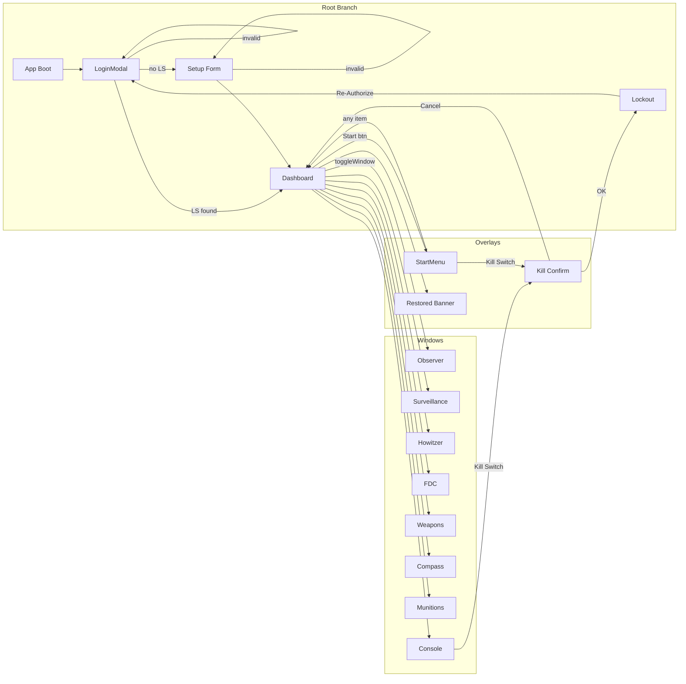

# 09_NAVIGATION_MAP

## OVERVIEW

**VERIFIED:** ระบบไม่มี URL router (React Router, TanStack Router, Next.js, ฯลฯ) — การนำทางเป็นการ toggle state ล้วน

## NAVIGATION LAYERS

### Layer 1: Root-level view branch (mutually exclusive)
Managed in `App.tsx:346-378`:
- `forceLockout === true` → Lockout screen
- `else if (!isLoggedIn)` → LoginModal (which may internally show Setup)
- `else` → Dashboard

### Layer 2: Window navigation (8 windows, non-exclusive)
Managed in `App.tsx:104-113` (`windows[]` state) and rendered `494-660`.

**4 different access points** (see CA-06 in taxonomy):
1. Header quick-launch buttons (`App.tsx:419-435`)
2. Desktop icons (`App.tsx:470-490`)
3. Taskbar task buttons (`App.tsx:746-767`)
4. Start Menu program items (`App.tsx:677-689`)

### Layer 3: Tab navigation (within Windows)
Local `useState<'x' | 'y'>` in each Window component:

| Window | Tab options |
|---|---|
| ForwardObserver | `grid` \| `polar` \| `shift` |
| Surveillance | `traverse` \| `intersection` \| `slope` \| `calibration` |
| Howitzer | `m17` \| `crater` |
| FDC | `ballistics` \| `minqe` |
| Weapons | `fuze` \| `icm` \| `misfire` |
| Compass | (single view) |
| Munitions | (single view) |
| Console | (single view) |

### Layer 4: Overlay navigation (transient)
- Restored banner (auto-hide 4s)
- Start Menu popup (toggle)
- Kill Switch confirm (native)

## VIEW-STATE TRIGGERS

| Trigger | Source | Effect |
|---|---|---|
| App boot | React mount | Enter Layer 1 branching |
| Login success | `onSuccess(...)` callback | `isLoggedIn=true` → Dashboard |
| Hydration (restored=true) | `onSuccess({restored:true})` | Same + 4s banner |
| Setup success (restored=false) | `onSuccess({restored:false})` | Same, no banner |
| Kill Switch | `handleKillSwitch()` | `forceLockout=true` → Lockout |
| Re-Authorize | Lockout button | `forceLockout=false` → Login (isLoggedIn still false) |
| Header/Desktop/Taskbar/StartMenu button | `toggleWindow(id)` | flip `isOpen`/`isMinimized` + focus |
| Window title bar drag | mousemove | `windows[i].x/y` update |
| Window close X | `handleCloseWindow` | `isOpen=false` |
| Window minimize | `handleMinimizeWindow` | `isMinimized=true` |
| Window click | `handleFocusWindow` | `zIndex = max+1`, `isMinimized=false` |
| Tab click | local `setActiveTab(x)` | Window internal switch |

## CROSS-FEATURE NAVIGATION

- **Target creation from FO** → activeTarget update → FDC auto-recomputes (no navigation, but visual link)
- **Gun drag in Howitzer** → gunPositions update → FDC per-gun table updates
- **Crater CB submit** → new target appears in map + FO dropdown (Shift Known Point)
- **Compass level** → gates FIRE button in FDC (implicit gate, no navigation)
- **Weapons ICM violation** → gates FIRE button in FDC
- **Simulate Call (Console/StartMenu)** → activeTarget update + logs

## NO NAVIGATION CONCEPT FOR

- **Deep link** — no URL hash routing
- **Back/Forward browser navigation** — pushState/popState not used → back button exits app
- **Refresh persistence** — only battery coords persist; window layout, active target, gun positions, logs all lost
- **Multi-tab** — each tab has independent state; localStorage sync not implemented

## MERMAID: NAVIGATION GRAPH

## VIEW STATE / CURRENTVIEW ANALYSIS

**VERIFIED:** ไม่มี variable ชื่อ `currentView` หรือ `route` หรือ `page` ในโค้ด — เพราะระบบเป็น 3-branch เท่านั้น + windows list

**INFERRED:** ถ้าจะเพิ่ม deep-linking (URL routing) ในอนาคต จะต้อง:
1. เพิ่ม `react-router-dom` เข้า deps
2. Refactor `App.tsx` 3-branch เป็น routes
3. Serialize `windows[]` state ลง URL params or session
4. Handle browser back button

## OPENWINDOW / MODAL STATE VARIABLES

| Variable | Location | Purpose |
|---|---|---|
| `isLoggedIn` | `App.tsx:19` | Layer 1 gate |
| `forceLockout` | `App.tsx:23` | Layer 1 override |
| `showSetup` | `LoginModal.tsx:19` | Inner switch (Login ↔ Setup) |
| `showRestoredBanner` | `App.tsx:22` | Layer 3 transient |
| `isStartMenuOpen` | `App.tsx:69` | Layer 3 toggle |
| `windows[i].isOpen` | `App.tsx:104-113` | Layer 2 visibility |
| `windows[i].isMinimized` | `App.tsx:104-113` | Layer 2 collapse |
| `windows[i].zIndex` | `App.tsx:104-113` | Layer 2 stacking |
| `isMaximized` | `WindowManager.tsx:41` (local) | Per-window size mode |
| `activeTab` | local in each *Window.tsx | Layer 3 in-window |
