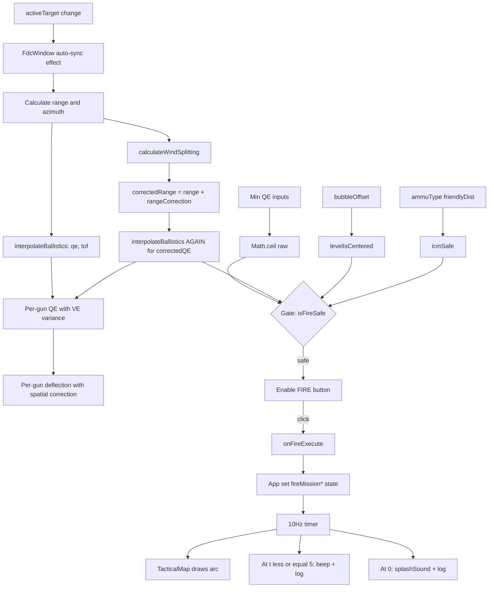

# 12_DATA_FLOW

## FLOW-01: LOGIN → HYDRATION → DASHBOARD

```
User input (operatorId, accessKey)
    → LoginModal local state
    → handleLogin (validate non-empty)
    → setTimeout(1500ms) mock
    → localStorage.getItem('artyc2_battery_coords')
        ├─ found → JSON.parse → onSuccess({restored:true})
        │       → App.handleLoginSuccess
        │            → setOperatorId
        │            → setBatteryCoords (from parsed)
        │            → setHeadingMils(simDir)
        │            → setIsLoggedIn(true)
        │            → setShowRestoredBanner(true) + setTimeout(4000) auto-hide
        │            → addLogEvent('[กู้คืน]')
        │       → Dashboard renders + banner
        └─ not found → setShowSetup(true) → Setup form
                → handleSetupSubmit
                → validate ranges
                → localStorage.setItem(...)
                → onSuccess({restored:false})
                → same as above minus banner
                → addLogEvent('[ตั้งค่า]')
```

## FLOW-02: TARGET CREATION (Grid)

```
User fills: targetName, gridE, gridN, gridH
    → ForwardObserverWindow.local state
    → click "บันทึกพิกัดเป้าหมาย"
    → handleApplyGridTarget
        → playBeep(900)
        → generate random id
        → onAddTarget(newTgt) [prop → App.handleAddTarget → setTargetsList]
        → onSetTarget(newTgt) [prop → App.handleSetTarget → setActiveTarget + sync list]
        → onLogEvent('[CALL_FOR_FIRE]')
    → App state updates propagate to:
        → TacticalMap re-render (target dot + threat dome)
        → FdcWindow re-render (range/azimuth/QE/ToF re-computed)
        → ControlPanelWindow re-render (new log entry)
```

## FLOW-03: TARGET CREATION (Polar)

```
User fills: foE, foN, polarAzimuth (mils), polarDistance (m)
[polarDistance may be pre-filled by FLOW-05 (Flash-to-Bang) or FLOW-06 (Mil Formula)]
    → click "คำนวณพิกัดเชิงขั้ว"
    → handleApplyPolarTarget
        → calculatePolarPlot(foE, foN, polarAzimuth, polarDistance)
            → angleRad = mils × 2π/6400
            → ΔE = D · sin(angleRad)
            → ΔN = D · cos(angleRad)
            → return {easting: round(foE+ΔE), northing: round(foN+ΔN)}
        → onAddTarget + onSetTarget with name 'POLAR-...'
        → onLogEvent
    (Same downstream as FLOW-02)
```

## FLOW-04: TARGET CREATION (Shift)

```
User selects known point (dropdown) → shiftFromId
User fills lateralShift, rangeShift, altitudeShift
    → click "เลื่อนจากพิกัดที่รู้ค่า" [disabled if !shiftFromId]
    → handleApplyShiftTarget
        → find knownPt in targetsList
        → newE = knownPt.E + lateralShift  (UTM axis, NOT observer axis)
        → newN = knownPt.N + rangeShift
        → newH = knownPt.H + altitudeShift
        → onAddTarget + onSetTarget with name 'SHIFT-<knownName>'
```

## FLOW-05: FLASH-TO-BANG

```
Click Start → setInterval(100ms) incrementing timerSeconds
User claps stopwatch on bang
Click Stop → setTimerRunning(false), dist = timerSeconds × 340 m/s
    → setPolarDistance(dist)  [feeds FLOW-03 input]
    → onLogEvent('[จับเวลา]: หยุด... -> ระยะทางเสียง...')
```

## FLOW-06: MIL FORMULA

```
Slide objectWidth (5-100m), type milAngle
    → live compute: computedMilDistance = (W × 1000) / M
Click "นำไปใช้" [disabled if M=0]
    → setPolarDistance(computedMilDistance)  [feeds FLOW-03]
    → onLogEvent('[สูตรมิลเลียน]')
```

## FLOW-07: TARGET ADJUSTMENT

```
User clicks arrow (e.g., ADD 100)
    → handleAdjustment('ADD', 100)
        → guard: if !activeTarget → beep(440) + return
        → mutate: activeTarget.northing += 100
        → onSetTarget(updated)  [prop → App]
        → onLogEvent('[WEBSOCKET_ADJUSTMENT]')
    → App updates activeTarget
    → TacticalMap redraws (target moves)
    → FdcWindow recomputes range/azimuth
```

## FLOW-08: TRAVERSE (Survey)

```
User edits table cell (bearing or distance)
    → handleUpdateTraverse(idx, field, val)
    → setStations([...updated])
    → LIVE compute (on every render):
        Σ ΔE = Σ (D · sin(bearing × 2π/6400))
        Σ ΔN = Σ (D · cos(bearing × 2π/6400))
        closureDistError = √(ΣΔE² + ΣΔN²)
        closureBearingError = |(Σbearing - 3200) mod 6400|
    → isClosureLimitExceeded = (dist>10 OR bearing>2)
    → conditional render: yellow warning + disable submit / green ok
User clicks Submit [disabled if exceeded]
    → onLogEvent('[วงรอบ]')
    ↓
    NO further data flow — result is log-only
```

## FLOW-09: INTERSECTION

```
User fills stationAE, stationAN, bearingA, stationBE, stationBN, bearingB
Click "คำนวณ..."
    → handleSolveIntersection
    → check parallel (angle diff < 0.05 rad)
    → solve 2-line intersection matrix → (intE, intN)
    → onLogEvent('[สำรวจ]: ... E:X N:Y')
    ↓
    NO further data flow — result is log-only  ⚠️ WORKFLOW GAP
```

## FLOW-10: SLOPE

```
User fills slopeDistance, inclinometerAngle (°)
    → LIVE:
        θ = angle × π / 180
        H = D × cos(θ)
        ΔElev = D × sin(θ)
    → display live
Click "ยืนยัน" → onLogEvent
    NO further data flow — log-only
```

## FLOW-11: GRID CALIBRATION (STUB)

```
User slides slideX, slideY, or swing
    → onUpdateGridOffset({slideX, slideY, swing})
    → App.setGridOffset(...)
    → App re-renders → Footer display updates: "ΔE:X m | ΔN:Y m | SWING:Z M"
    ↓
    NO calculation reads gridOffset.  DEAD OUTPUT.
```

## FLOW-12: M.17 BOARD

```
User mousedown on gun G[k]
    → setDraggedGunId(k)
Global mousemove
    → handleBoardMouseMove
        → dx = e.clientX - centerX
        → dy = -(e.clientY - centerY)  [Y inverted]
        → onUpdateGuns([{...gun, offsetX:dx, offsetY:dy}, ...])
        → App.setGunPositions
Mouseup
    → onLogEvent('[กระดาน M.17]')
    → App state propagates to:
        → TacticalMap (gun dots move)
        → FdcWindow (per-gun deflection recompute:
            spatialCorrection = round(offsetX × 1000 / range)
            gunDeflection = finalDeflection + spatialCorrection)
```

## FLOW-13: CRATER → COUNTER-BATTERY

```
User fills splashDir, craterWidth, plumbBobAngle, windDir
    → LIVE weapon ID from craterWidth bins
    → LIVE validation:
        angleErrorCheck = |splashDir - windDir| > 2000
        isCraterValid = !angleErrorCheck && 10 ≤ plumb ≤ 80
Click Submit [disabled if !isCraterValid]
    → HARDCODED enemyEasting=34500, enemyNorthing=48500
    → onAddTarget({id:'CB-...', name:'CB-<weapon>', ...})
    → onLogEvent('[CRATER_ANALYSIS]')
    → Target propagates to map, FDC, dropdowns
```

## FLOW-14: FIRE MISSION (End-to-End)

```
Precondition: activeTarget exists
FdcWindow auto-sync effect (useEffect on activeTarget change):
    ΔE = target.E - battery.E
    ΔN = target.N - battery.N
    setTargetRange(round(√(ΔE² + ΔN²)))
    setFiringAzimuth(round((atan2(ΔE, ΔN) mod 2π) × 6400 / 2π))

Every render, FdcWindow computes:
    {qe, tof, error} = interpolateBallistics(targetRange)
        → find 2 bounding rows in CHARGE_5_FIRE_TABLE
        → linear interp
    {headwind, crosswind, rangeCorrection, deflectionCorrection}
        = calculateWindSplitting(firingAzimuth, windSpeed, windDirection)
        → angleDiff = windRad - firingRad
        → headwind = kts × cos(diff)
        → crosswind = kts × sin(diff)
        → rangeCorr = round(headwind × 3.5 × 10) / 10
        → deflCorr = round(-crosswind × 0.8 × 10) / 10
    correctedRange = targetRange + rangeCorrection
    correctedQE = interpolateBallistics(correctedRange).qe
    finalDeflection = 3200 + deflectionCorrection

    Per gun i (0..5):
        VE = GUN_VE_VARIANCES[i]  ← constants +1.2, -0.8, +0.4, -1.5, +0.2, -0.5
        spatialCorrection = round(gun.offsetX × 1000 / targetRange)
        gunDeflection = finalDeflection + spatialCorrection
        gunQE = round((correctedQE - VE × 0.15) × 10) / 10

Min QE tab (independent):
    rawMinQE = pieceToCrestSlope + 5 + round(crestHeight × 1000 / crestDistance)
    finalMinQE = Math.ceil(rawMinQE)  ← round-UP safety

Gate: isFireSafe = levelIsCentered && icmSafe && !interpError && correctedQE ≥ finalMinQE

Click FIRE (only if isFireSafe):
    → playFireSound()
    → onFireExecute(tof)
        → App.setFireMissionToF(tof)
        → App.setFireMissionTimeLeft(tof)
        → App.setFireMissionProgress(0)
        → App.setFireMissionActive(true)
    → onLogEvent('[FIRE_EXECUTE]: QE:... DF:... ToF:...')

App useEffect (fireMissionActive true) starts 10Hz timer:
    Every 100ms:
        next = max(0, prev - 0.1)
        setFireMissionTimeLeft(next)
        setFireMissionProgress(elapsed / tof)
        IF (next ≤ 5 && integer boundary) → playBeep(980) + log SPLASH_COUNTDOWN
        IF (next === 0) → playSplashSound() + log SPLASH_IMPACT + setFireMissionActive(false)

TacticalMap useEffect subscribes to fireMissionProgress:
    Draws parabolic arc using fireMissionProgress as parameter t
    Places projectile marker at (1-t)×battery + t×target with height offset
```

## FLOW-15: MISFIRE

```
User clicks misfire button
    → onMisfireToggle(!misfireActive)  [prop → App]
    → App.setMisfireActive(true)
    → App useEffect starts 1Hz timer:
        every 1000ms:
            IF (prev ≤ 1) → clear, setActive(false), log '[เสร็จสิ้น]', reset 1800
            ELSE:
                IF (prev % 10 === 0) → playAlarm(true)
                setMisfireTimeLeft(prev - 1)
```

## FLOW-16: KILL SWITCH

```
User clicks Kill Switch (Console or Start Menu)
    → window.confirm(...)
    OK →
        → App.handleKillSwitch:
            setIsLoggedIn(false)
            setOperatorId('')
            setActiveTarget(null)
            setTargetsList([])
            setLogs([])
            localStorage.clear()
            try: indexedDB.deleteDatabase('fdc_offline_queue')
            setForceLockout(true)
        → Layer-1 branch: Lockout screen
        → User clicks "เชื่อมต่อใหม่"
        → setForceLockout(false)
        → Layer-1 fallthrough: !isLoggedIn → LoginModal
    Cancel → no-op
```

## FLOW-17: OPSEC TOGGLE

```
Click header OPSEC button
    → setHideBatteryCoords(!prev)
    → prop passed to TacticalMap
    → TacticalMap:
        IF hide → skip drawing battery + guns
                → fillText red banner "🔒 พิกัดแบตเตอรีและ ศอย. ถูกพราง (เปิดโหมดพรางตำแหน่ง OPSEC)"
        ELSE → draw normally
    ⚠️ NOT propagated to: Header (still shows E:X N:Y), FDC (still computes)
```

## MERMAID: FIRE MISSION DATA FLOW



## INPUT-TO-OUTPUT SUMMARY TABLE

| Input | Owner | Flows to | Ends at |
|---|---|---|---|
| operatorId | LoginModal | App | Header display |
| Setup coords | LoginModal | localStorage → App on login | batteryCoords everywhere |
| Grid target inputs | ForwardObserver | App.targetsList/activeTarget | Map + FDC |
| Polar inputs | ForwardObserver | calculatePolarPlot → App | Map + FDC |
| Shift inputs | ForwardObserver | known + offsets → App | Map + FDC |
| Adjustment pad | ForwardObserver | mutate activeTarget → App | Map + FDC |
| Flash-to-Bang | ForwardObserver | polarDistance field | (chain to Polar) |
| Mil formula | ForwardObserver | polarDistance field | (chain to Polar) |
| Traverse table | Surveillance | LOG only | (nothing else) |
| Intersection form | Surveillance | LOG only | (nothing else) |
| Slope form | Surveillance | LOG + local display | (nothing else) |
| Calibration sliders | Surveillance | App.gridOffset | Footer display only |
| M.17 drag | Howitzer | App.gunPositions | Map + FDC per-gun table |
| Crater form | Howitzer | HARDCODED CB target → App | Map + FDC dropdowns |
| FDC range/azimuth manual | FdcWindow | local state | interpolation |
| Wind inputs | FdcWindow | local state | wind splitting |
| Min QE inputs | FdcWindow | local state | gate calc |
| Ammo dropdown | Weapons | App.ammuType | icmSafe + shell label |
| Fuze radio | Weapons | App.fuzeType | MunitionsWindow warning |
| Fuze slider | Weapons | App.fuzeTime | **NOWHERE** |
| Misfire button | Weapons | App.misfireActive | 1Hz timer + display |
| Compass drag | Compass | App.headingMils | **NOWHERE** (isolated) |
| Bubble drag | Compass | App.bubbleOffset | levelIsCentered gate |
| Supp charge checkbox | Munitions | App.supplementaryCharge | MunitionsWindow warning only |
| Kill Switch | Console/StartMenu | window.confirm → App wipe | Lockout screen |
| Simulate call | Console/StartMenu | inline sin/cos (⚠️ dup) → target | Map + FDC |
| OPSEC toggle | Header | App.hideBatteryCoords | Map only |
| Volume toggle | Tray | App.audioVolume | Emoji + log (FAKE) |
